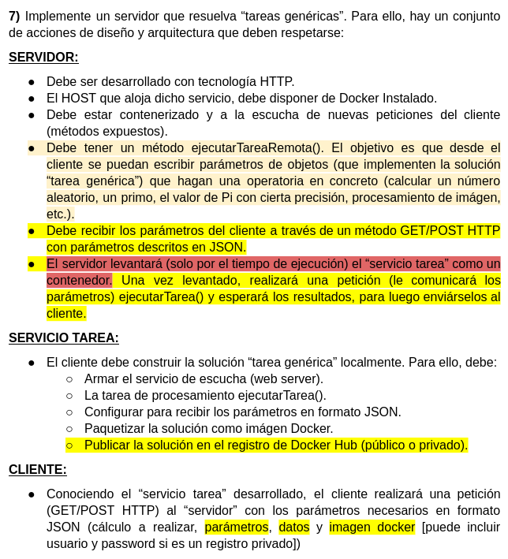

# Ejercicio 7

## Consigna



## Cómo ejecutar localmente

### Prerrequisitos

- Tener Docker instalado.

### Servidor

Se debe posicionar en el directorio `Server/target` y ejecutar el siguiente comando:
```
java -jar demo-0.0.1-SNAPSHOT
```

### Cliente

Con una plataforma para APIs (como puede ser Postman, Insomnia o un navegador web) realizar una petición HTTP POST a `http://localhost:8080/genericTask` con el siguiente JSON:
```
{
  "name": "randomNumberTask"
}
```
El servidor levantará un contenedor docker a partir de la imagen "sebmarch/tp1-e7-servicio", y luego de 20 segundos hará una petición HTTP a dicho servicio, el cual generará un número aleatorio para luego devolverlo al cliente.